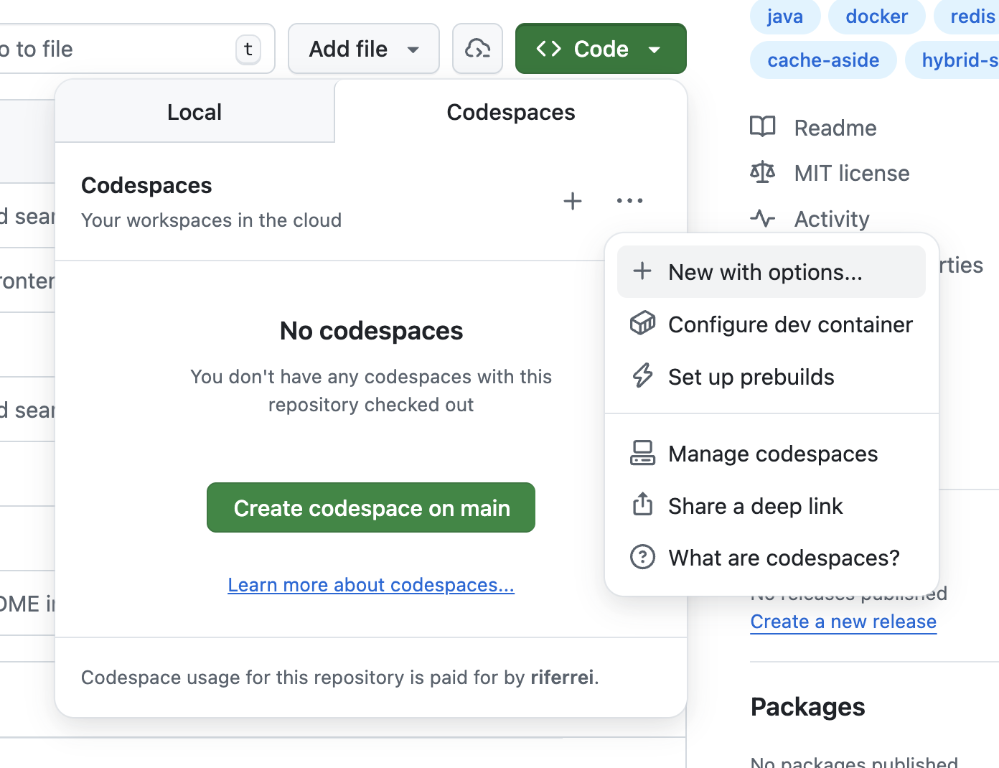
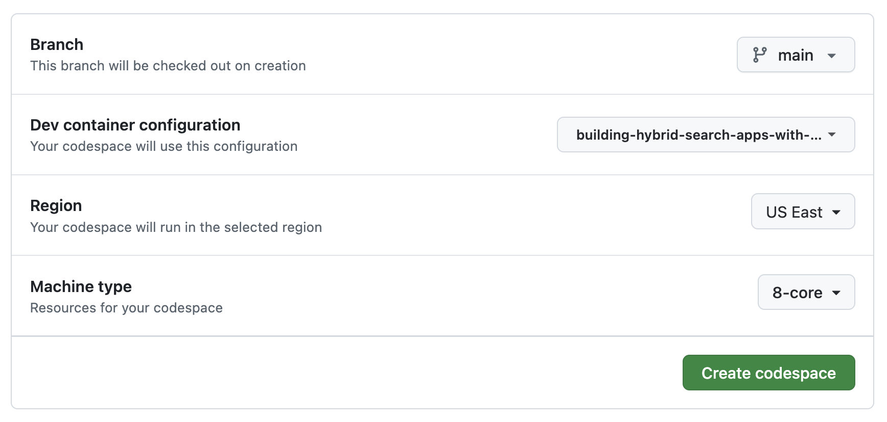

# Building Hybrid Search Apps with Redis

[](https://opensource.org/licenses/MIT)
[](https://www.oracle.com/java/technologies/downloads)
[](https://spring.io/projects/spring-boot)
[](https://redis.io/docs/latest/develop/interact/search-and-query/)
[](https://github.com/redis/redis-om-spring)

## 🌟 Overview
Welcome to this hands-on workshop where you'll design and implement modern search experiences with Redis. You start with a working HTML/JS + Spring Boot app that implements hybrid search manually and with an empty Redis database, and evolve it step by step into a production-style hybrid search flow. In this workshop, you will learn how to efficiently load JSON data into Redis, create field embeddings, leverage Redis's native hybrid search support, and implement the cache aside pattern for query reuse.

### 🤔 Why Hybrid Search?
Search quality drops when you disregard design principles like:
- Full-text search alone can miss intent when wording changes even minimally
- Vector search alone can return semantically related but lexically weak matches
- App-side hybrid search logic can increase complexity and latency

Hybrid search lets you combine lexical precision and semantic relevance in one retrieval flow.

### 🎯 What You'll Build
By the end of this workshop, you'll build a complete Redis-powered search app with:
- Support for typed queries with Redis OM for Spring
- Redis JSON document data loading, modeling, and indexing
- Native Redis hybrid search implemented with Spring Boot
- Startup embedding regeneration for existing records
- Prompt-embedding cache-aside via `Keyword` documents

## 📋 Prerequisites

### Required knowledge
- Basic Java and Spring Boot familiarity
- Basic understanding of search concepts
- Familiarity with command-line tools
- Basic understanding of Docker and Git

### Required software

#### Option 1: GitHub Codespaces
- GitHub account
- Access to GitHub Codespaces (quota/billing enabled)
- Browser or VS Code with Codespaces support

#### Option 2: Dev Containers locally
- [Docker](https://docs.docker.com/get-docker/)
- Java IDE compatible with [Dev Containers](https://containers.dev/)
  - [VS Code](https://code.visualstudio.com/)
  - [IntelliJ IDEA](https://www.jetbrains.com/idea/)

#### Option 3: Local development
- [Java 21+](https://www.oracle.com/java/technologies/downloads)
- [Maven 3.9+](https://maven.apache.org/install.html)
- [Docker](https://docs.docker.com/get-docker/)
- [Git](https://git-scm.com/install/)
- [RIOT](https://redis.io/docs/latest/develop/tools/riot/)
- [Redis Insight](https://redis.io/insight/)
- Java IDE

### Required accounts
No paid account is required for the core workshop flow. Everything can run locally with Docker.

## 🗺️ Workshop Structure
This workshop has an estimated duration of 1.5 hours and is organized into 5 progressive labs, each building on the previous one. Each lab introduces a specific technical challenge, which is then addressed in the subsequent lab.

| Lab | Topic                                                                   | Duration | Branch |
|:----|:------------------------------------------------------------------------|:---------|:-------|
| 1 | [Get the Search Up and Running](../../blob/lab-1-starter/README.md)     | 20 mins  | `lab-1-starter` |
| 2 | [Importing Data into Redis](../../blob/lab-2-starter/README.md)         | 10 mins  | `lab-2-starter` |
| 3 | [Implementing Embedding Creation](../../blob/lab-3-starter/README.md)   | 25 mins  | `lab-3-starter` |
| 4 | [Implementing Native Hybrid Search](../../blob/lab-4-starter/README.md) | 25 mins  | `lab-4-starter` |
| 5 | [Caching Prompt Embedding](../../blob/lab-5-starter/README.md)          | 10 mins  | `lab-5-starter` |

Each lab also contains a corresponding `lab-X-solution` branch with the completed code for reference. You can use this branch to compare your current implementation using `git diff {lab-X-solution}`. Alternatively, you can switch to the solution branch at any time during the lab if you are falling behind or to get unstuck.

## 🚀 Getting Started

### Step 1: Choose your setup option
Pick one of the setup options from the Prerequisites section:
- GitHub Codespaces
- Dev Containers locally
- Local development

### Step 2: Start your workspace
If you're using **GitHub Codespaces**:
- Create a new Codespace for this repository
  
  

If you are using **Dev Containers locally**:
- Clone the repository:
  ```bash
  git clone https://github.com/redis-developer/building-hybrid-search-apps-with-redis.git
  ```
- Open the project in a Dev Container. The instructions for doing this vary by IDE. Follow the guides for either [VS Code](https://code.visualstudio.com/docs/devcontainers/containers#_quick-start-open-an-existing-folder-in-a-container) or [IntelliJ IDEA](https://www.jetbrains.com/help/idea/start-dev-container-from-welcome-screen.html).

If you're using **Local development**:
- Clone the repository:
  ```bash
  git clone https://github.com/redis-developer/building-hybrid-search-apps-with-redis.git
  ```
- Verify the installed tools
  ```bash
  java -version
  mvn -version
  docker --version
  git --version
  riot --version
  ```
  
### Step 3: Proceed to Lab 1

You can now start the [Lab 1: Get the Search Up and Running](../../blob/lab-1-starter/README.md)

```bash
git checkout lab-1-starter
```
Then follow the README instructions

## 📚 Resources
- [Redis Search](https://redis.io/docs/latest/develop/interact/search-and-query/)
- [Redis OM Spring](https://github.com/redis/redis-om-spring)
- [RIOT Documentation](https://redis.github.io/riot/)
- [Redis Insight](https://redis.io/insight/)

## 🤝 Contributing
Contributions are welcome! Please feel free to submit a Pull Request. For major changes, please open an issue first to discuss what you would like to change.

## 👥 Maintainers
- Ricardo Ferreira — [@riferrei](https://github.com/riferrei)

## 📄 License
This project is licensed under the [MIT License](./LICENSE).
