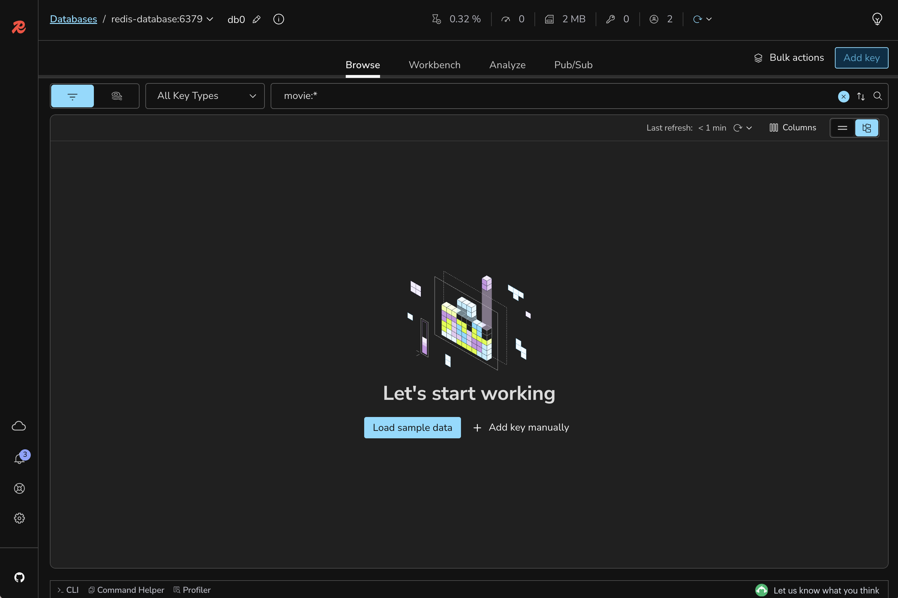
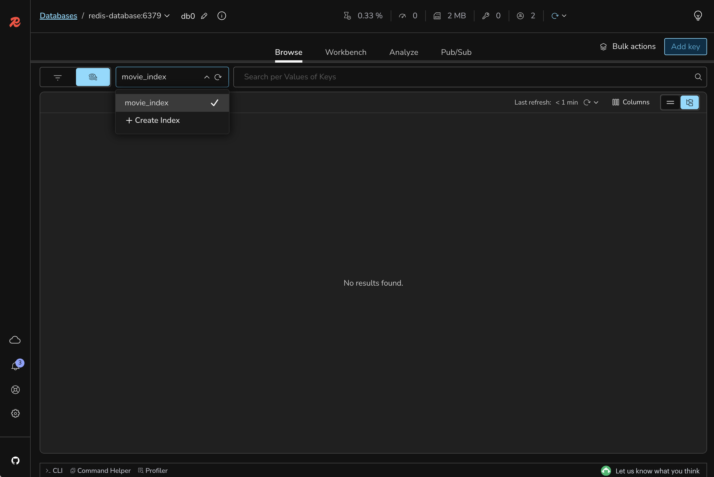

# Lab 1: Get the Search Up and Running

## 🎯 Learning Objectives
By the end of this lab, you will:
- Run the full workshop stack in your selected environment (Codespaces, Dev Containers, or Local development)
- Understand the baseline search architecture used across the workshop
- Observe the Redis Search index creation on the first app run
- Validate the API and UI are operational before loading data
- Understand the initial search path (`manualHybridSearch`) and core domain model

#### 🕗 Estimated Time: 20 minutes

## 🏗️ What You're Building
In this foundational lab, you'll bring up the base movie search application and prepare Redis for queries.

This includes:
- **Frontend (NGINX)**: search UI for movie lookup testing
- **Spring Boot API**: `/search` endpoint for query execution
- **Redis 8 + Query Engine**: storage and indexing layer
- **Initial Search Strategy**: manual hybrid method already implemented in code

### Application Screenshot


## 📋 Prerequisites Check
Before starting, confirm the checklist for the setup option you selected:

### Option 1: GitHub Codespaces
- [ ] Codespace created and running for this repository
- [ ] Ports `8080`, `8081`, `5540`, and `6379` are forwarded
- [ ] Terminal is available inside the Codespace

### Option 2: Dev Containers locally
- [ ] Docker is up and running
- [ ] Repository opened in your IDE Dev Container
- [ ] Ports `8080`, `8081`, `5540`, and `6379` are available/forwarded

### Option 3: Local development
- [ ] Java 21+ installed
- [ ] Maven 3.9+ installed
- [ ] Docker up and running
- [ ] Git configured

### Lab-specific requirements
- [ ] No previous lab required (this is the workshop entry point)

## 🚀 Setup Instructions
> 💡 If you are using either GitHub Codespaces or Dev Containers, you must use the forwarded URL from the Ports panel for proper access. Also, you may use the sidecar service DNS names from the workspace terminal when needed, such as using `redis-database` to access Redis.
> 

### Step 1: Inspect the frontend layer
Take a quick look at the frontend code to understand what the UI is doing before you run the app.

Key files:
- `app/index.html`
- `app/scripts/script.js`
- `app/scripts/apis.js`
- `nginx/nginx.conf`

### Step 2: Inspect the backend layer
Review the core backend classes to understand how search requests are handled.

Key files:
- `src/main/java/io/redis/movies/searcher/core/controller/SearchController.java`
- `src/main/java/io/redis/movies/searcher/core/service/SearchService.java`
- `src/main/java/io/redis/movies/searcher/core/domain/Movie.java`
- `src/main/java/io/redis/movies/searcher/core/domain/ResultType.java`
- `src/main/java/io/redis/movies/searcher/RedisMoviesSearcher.java`

### Step 3: Start infrastructure services
If you are running from **Local development**, run:

```bash
docker compose up -d
```

If you are using **GitHub Codespaces** or **Dev Containers**, these services are started automatically with the environment.

### Step 4: Build and start the backend

```bash
mvn clean package
```

Then run:

```bash
mvn spring-boot:run
```

> 💡 From this point on, every time you change backend code, rebuild and run the backend again before validating behavior.

## 🧪 Testing Your Setup

### API reachability test

To check if the backend is working as expected, let's perform an API call. Use the endpoint `http://localhost:8081` if it is running locally, or the forwarded URL. For example:

```bash
curl "http://localhost:8081/search?query=star"
```
You should get a JSON payload with `resultType` and `matchedMovies`.

### UI verification
1. Open the frontend (`http://localhost:8080/redis-movies-searcher` or forwarded URL)
2. Type any query. It can be as simple as `star`
3. After typing it, confirm there are no UI errors
4. Check backend logs and confirm requests came

### Redis verification
Use Redis Insight to inspect what happened at Redis level:
1. Open Redis Insight (`http://localhost:5540` or forwarded URL)
2. Connect to Redis (`redis-database:6379` in Codespaces/Dev Containers, or `localhost:6379` locally)
3. Search for keys with pattern `movie:*` and confirm there are no records yet
   
4. Open the indexes view (or run commands panel) and confirm `movie_index` exists
   

## 🎨 Understanding the Code
### 1. `SearchController`
- Exposes `GET /search`
- Delegates query execution to the service layer

### 2. `SearchService`
- Uses `manualHybridSearch(...)` in this phase
- Contains lexical + vector fallback orchestration

### 3. `Movie` and `ResultType`
- `Movie` defines document mapping and vector-capable fields
- `ResultType` exposes which strategy generated the response

## 🔍 What's Still Missing?
At this stage, the app is operational, but:
- ❌ No movie dataset is loaded
- ❌ Existing records still have no embedding backfill
- ❌ Native Redis hybrid path is not active
- ❌ Prompt embedding cache-aside is not implemented

## 🐛 Troubleshooting
<details>
<summary>Connection refused on port 8081</summary>

Ensure `mvn spring-boot:run` is running and startup completed.
</details>

<details>
<summary>UI loads but search fails</summary>

Verify backend is reachable at `http://localhost:8081/search` and CORS is configured for your UI origin.
</details>

<details>
<summary>Index is not created on startup</summary>

Check backend startup logs for index creation errors, then verify index state:

```bash
redis-cli -h redis-database FT.INFO movie_index
```

```bash
redis-cli FT.INFO movie_index
```
</details>

## 🎉 Lab Completion
Congratulations. You now have:
- ✅ Running UI, API, Redis, and Redis Insight
- ✅ A valid Redis index for movie search
- ✅ A baseline app ready for data ingestion

## ➡️ Next Steps
Proceed to [Lab 2: Importing Data into Redis](../../blob/lab-2-starter/README.md)

```bash
git checkout lab-2-starter
```
