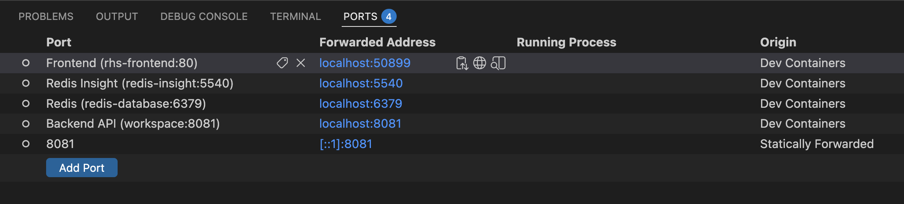

# Lab 3: Implementing Embedding Creation

## 🎯 Learning Objectives
By the end of this lab, you will:
- Implement the new startup `loadData()` hook in `RedisMoviesSearcher`
- Understand the role of `MovieService` and `MovieRepository` for embedding backfill
- Implement `regenerateMissingEmbeddings()` using Redis SCAN + batched persistence
- Understand why first startup can be slower, and why later startups are faster
- Enable vector search behavior by ensuring movies have `plotEmbedding`

#### 🕗 Estimated Time: 25 minutes

## 🏗️ What You're Building
In this lab, you'll add a startup pipeline that backfills embeddings for previously imported movies.

This includes:
- **`loadData()` in `RedisMoviesSearcher`** to trigger regeneration on startup
- **`MovieService.regenerateMissingEmbeddings()`** embedding creation implementation
- **`MovieRepository` usage** (`findAllById`, `saveAll`) to process movie batches

## 📋 Prerequisites Check
Before starting, confirm the checklist for the setup option you selected:

### Option 1: GitHub Codespaces
- [ ] Codespace is running for this repository
- [ ] Ports `8080`, `8081`, `5540`, and `6379` are forwarded
- [ ] Lab 2 completed in this Codespace environment

### Option 2: Dev Containers locally
- [ ] Project opened in your IDE Dev Container
- [ ] Containers are healthy and ports are available/forwarded
- [ ] Lab 2 completed in this Dev Container environment

### Option 3: Local development
- [ ] Local Docker environment is running
- [ ] Lab 2 completed locally
- [ ] Redis, frontend, and backend services are up

### Lab-specific requirements
- [ ] Dataset imported into Redis (`movie:*` keys exist)
- [ ] `movie_index` already created

## 🚀 Setup Instructions
> 💡 If you are using either GitHub Codespaces or Dev Containers, you must use the forwarded URL from the Ports panel for proper access. Also, you may use the sidecar service DNS names from the workspace terminal when needed, such as using `redis-database` to access Redis.
> 

### Step 1: Implement startup hook
Open `src/main/java/io/redis/movies/searcher/RedisMoviesSearcher.java`.

In this class, `loadData(...)` returns `null`.

Replace this:
```java
@Bean
CommandLineRunner loadData(MovieService movieService) {
    // Make sure to implement the call to regenerate
    // the embeddings during the application startup
    return null;
}
```

With this:
```java
@Bean
CommandLineRunner loadData(MovieService movieService) {
    return args -> {
        movieService.regenerateMissingEmbeddings();
    };
}
```

### Step 2: Implement embedding regeneration
Open `src/main/java/io/redis/movies/searcher/core/service/MovieService.java`.

You will see a new service class in this lab: `MovieService`.

Its responsibility is to:
- Scan Redis for records with `movie:*` keys
- Process only movies missing `plotEmbedding`

Now replace this:
```java
public void regenerateMissingEmbeddings() {
    // Implement this method to generate embeddings during startup
}
```

With this:
```java
public void regenerateMissingEmbeddings() {
    log.info("Scanning for movies with missing embeddings...");
    Instant startTime = Instant.now();

    // Phase 1: Scan for all movie keys using SCAN command
    List<Integer> movieIds = new ArrayList<>(10000);
    ScanOptions scanOptions = ScanOptions.scanOptions()
            .match(KEY_PREFIX + "*")
            .count(1000)
            .build();

    try (Cursor<String> cursor = redisTemplate.scan(scanOptions)) {
        while (cursor.hasNext()) {
            String key = cursor.next();
            String idStr = key.substring(KEY_PREFIX.length());
            try {
                movieIds.add(Integer.parseInt(idStr));
            } catch (NumberFormatException e) {
                log.warn("Skipping invalid key: {}", key);
            }
        }
    }

    log.info("Found {} movie keys in Redis", movieIds.size());

    // Phase 2: Load, filter, and save in bounded concurrent batches
    final int batchSize = 200;
    final int estimatedTotal = movieIds.size();
    final int maxWorkers = 2;

    AtomicInteger processedCounter = new AtomicInteger(0);

    try (ExecutorService executor = Executors.newVirtualThreadPerTaskExecutor()) {
        List<CompletableFuture<Void>> inFlight = new ArrayList<>(maxWorkers);

        for (int i = 0; i < movieIds.size(); i += batchSize) {
            List<Integer> batchIds = movieIds.subList(i, Math.min(i + batchSize, movieIds.size()));

            List<Movie> moviesNeedingEmbeddings = new ArrayList<>();
            movieRepository.findAllById(batchIds).forEach(movie -> {
                if (movie.getPlot() != null && !movie.getPlot().isBlank()
                        && movie.getPlotEmbedding() == null) {
                    moviesNeedingEmbeddings.add(movie);
                }
            });

            if (moviesNeedingEmbeddings.isEmpty()) {
                continue;
            }

            List<Movie> batch = new ArrayList<>(moviesNeedingEmbeddings);

            CompletableFuture<Void> future = CompletableFuture.runAsync(() -> {
                try {
                    movieRepository.saveAll(batch);

                    int total = processedCounter.addAndGet(batch.size());
                    int previousMilestone = (total - batch.size()) / 1000;
                    int currentMilestone = total / 1000;
                    if (currentMilestone > previousMilestone) {
                        double percentComplete = (total * 100.0) / estimatedTotal;
                        log.info("Regenerated embeddings: ~{}% ({} movies processed)",
                                String.format("%.1f", percentComplete), total);
                    }
                } catch (Exception ex) {
                    log.error("Error saving batch: {}", ex.getMessage(), ex);
                }
            }, executor);

            inFlight.add(future);

            // Bound concurrency: wait every maxWorkers tasks
            if (inFlight.size() >= maxWorkers) {
                CompletableFuture.allOf(inFlight.toArray(new CompletableFuture[0])).join();
                inFlight.clear();
            }
        }

        if (!inFlight.isEmpty()) {
            CompletableFuture.allOf(inFlight.toArray(new CompletableFuture[0])).join();
        }
    }

    int totalProcessed = processedCounter.get();
    if (totalProcessed == 0) {
        log.info("No movies with missing embeddings found.");
        return;
    }

    Duration duration = Duration.between(startTime, Instant.now());
    double seconds = duration.toMillis() / 1000.0;
    log.info("Embedding regeneration complete: {} movies processed in {} seconds",
            totalProcessed, String.format("%.2f", seconds));
}
```

What this code does:
- Scans Redis using `SCAN movie:*` to collect all movie IDs without blocking Redis.
- Loads movies in batches and keeps only records that have a `plot` but no `plotEmbedding`.
- Saves eligible batches via `movieRepository.saveAll(...)`, which triggers embedding generation.
- Uses bounded concurrency (`maxWorkers`) to avoid memory spikes while still processing in parallel.
- Logs progress and total execution time, and exits quickly when no backfill is needed.

### Step 3: Rebuild and run
Run these commands separately from the workspace terminal:

```bash
mvn clean package
```

Then run:

```bash
mvn spring-boot:run
```

Important behavior:
- Startup can take longer on the first run because the app needs to create embeddings.
- On later runs, if embeddings are already present, startup is much faster.
- This backfill is required for vector search to return meaningful results.

## 🧪 Testing Your Implementation
### Check backfill progress in logs
Expect logs similar to:
- `Scanning for movies with missing embeddings...`
- `Found X movie keys in Redis`
- `Regenerated embeddings: ...`
- `No movies with missing embeddings found.`

### Verify embeddings in Redis Insight
1. Open Redis Insight (`http://localhost:5540` or forwarded URL)
2. Connect to `redis-database:6379` (Codespaces/Dev Containers) or your local Redis endpoint
3. Browse `movie:*` documents
4. Open a movie and verify that the `plotEmbedding` field now exists

### Semantic query check
```bash
curl "http://localhost:8081/search?query=dude%20who%20teaches%20rock"
```
With embeddings generated, vector search can contribute results for semantic queries.

### UI validation
1. Open `http://localhost:8080/redis-movies-searcher`
2. Search for `star`
3. Search for `dude who teaches rock`
4. Confirm no browser errors and consistent results

## 🎨 Understanding the Code
### 1. `MovieService`
- Handles embedding backfill for already imported records
- Uses `MovieRepository` to load and save in batches
- Persists only movies missing `plotEmbedding`

### 2. `CommandLineRunner` in `RedisMoviesSearcher`
- Ensures regeneration runs automatically on startup
- Keeps workshop flow reproducible

### 3. `MovieRepository`
- Provides `findAllById(...)` so `MovieService` can load movies in controlled batches.
- Provides `saveAll(...)` so backfill updates are persisted efficiently.
- Acts as the bridge between startup embedding logic and Redis document storage.

## 🔍 What's Still Missing?
At this stage, the app supports manual hybrid behavior with embeddings, but:
- ❌ Native hybrid implementation is not active yet
- ❌ Prompt embedding cache-aside is not active yet

## 🐛 Troubleshooting
<details>
<summary>No embeddings are generated</summary>

Check that movies contain non-empty `plot` values and missing `plotEmbedding` before startup.
</details>

<details>
<summary>Startup feels slow</summary>

Initial full backfill can take time. Review logs and tune batch settings if needed.
</details>

<details>
<summary>`plotEmbedding` stays null</summary>

Verify startup completed and regeneration did not fail in logs.
</details>

## 🎉 Lab Completion
Congratulations. You now have:
- ✅ Startup embedding backfill implemented
- ✅ Existing movies enriched with vector embeddings
- ✅ Strong semantic retrieval foundation

## ➡️ Next Steps
Proceed to [Lab 4: Implementing Native Hybrid Search](../../tree/lab-4-starter/README.md)

```bash
git checkout lab-4-starter
```
