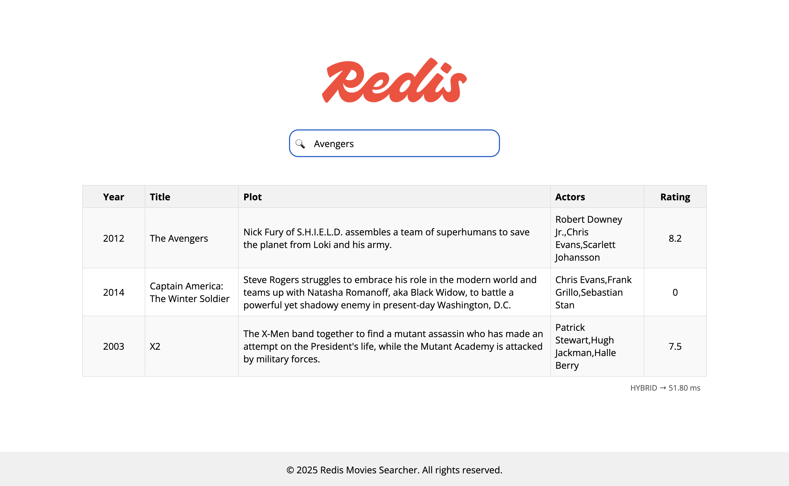

# Building Hybrid Search Apps with Redis (Java Workshop)

[](https://opensource.org/licenses/MIT)
[](https://www.oracle.com/java/technologies/downloads)
[](https://spring.io/projects/spring-boot)
[](https://redis.io/docs/latest/develop/interact/search-and-query/)
[](https://github.com/redis/redis-om-spring)

## 🌟 Overview
Welcome to this hands-on workshop where you'll design and implement modern search experiences with Redis. You start with a working Spring Boot app and evolve it step by step into a production-style hybrid search flow.

By the end, you will have implemented:
- full-text search (FTS)
- vector similarity search (VSS)
- native hybrid search
- cache-aside for prompt embeddings



### 🤔 Why Hybrid Search?
Search quality drops when you rely on a single strategy:
- FTS alone can miss intent when wording changes
- VSS alone can return semantically related but lexically weak matches
- app-side fallback logic can increase complexity and latency

Hybrid search lets you combine lexical precision and semantic relevance in one retrieval flow.

### 🎯 What You'll Build
Throughout this workshop, you'll build a complete Redis-powered movie search app with:
- Redis JSON document modeling and indexing
- Full-Text Search with Redis Query Engine
- Vector search using embeddings
- Native Redis hybrid search in the service layer
- Startup embedding regeneration for existing records
- Prompt-embedding cache-aside via `Keyword` documents
- Browser UI to validate behavior and latency

## 📋 Prerequisites
### Required knowledge
- Basic Java and Spring Boot familiarity
- Basic understanding of search concepts (keywords, ranking)
- Familiarity with command-line tools
- Basic understanding of Docker and Git

### Required software
#### Option 1: GitHub Codespaces
- GitHub account
- Access to GitHub Codespaces (quota/billing enabled)
- Browser or VS Code with Codespaces support

#### Option 2: Local development
- [Java 21+](https://www.oracle.com/java/technologies/downloads)
- [Maven 3.9+](https://maven.apache.org/install.html)
- [Docker](https://docs.docker.com/get-docker/)
- [Git](https://git-scm.com/install/)
- [RIOT](https://redis.io/docs/latest/develop/tools/riot/)
- Java IDE

### Required accounts
No paid account is required for the core workshop flow. Everything can run locally with Docker.

## 🗺️ Workshop Structure
This workshop is designed for ~90 minutes across 5 progressive labs.

| Lab | Topic | Duration | Branch |
|:----|:------|:---------|:-------|
| 1 | [Get the search up and running](../../tree/lab-1-starter/README.md) | 20 mins | `lab-1-starter` |
| 2 | [Importing data into Redis](../../tree/lab-2-starter/README.md) | 15 mins | `lab-2-starter` |
| 3 | [Implementing embedding creation](../../tree/lab-3-starter/README.md) | 20 mins | `lab-3-starter` |
| 4 | [Implementing native hybrid search](../../tree/lab-4-starter/README.md) | 20 mins | `lab-4-starter` |
| 5 | [Caching prompt embedding](../../tree/lab-5-starter/README.md) | 15 mins | `lab-5-starter` |

Each lab also has a `lab-X-solution` branch with the completed implementation.

## 🚀 Getting Started
### Step 1: Choose your setup option
Pick one of these options:
- GitHub Codespaces
- Local development

### Step 2: Start your workspace
If you're using **GitHub Codespaces**:
- Create a new Codespace for this repository
- Forward ports `8080`, `8081`, `5540`, and `6379`

If you're using **Local development**:
```bash
git clone https://github.com/redis-developer/building-hybrid-search-apps-with-redis.git
cd building-hybrid-search-apps-with-redis
java -version
mvn -version
docker --version
git --version
riot --version
```

### Step 3: Start infrastructure
```bash
docker compose up -d redis-database redis-insight rhs-frontend
```

### Step 4: Run backend
```bash
./mvnw spring-boot:run
```

Access points:
- App UI: `http://localhost:8080/redis-movies-searcher`
- API: `http://localhost:8081/search?query=star`
- Redis Insight: `http://localhost:5540`

### Step 5: Start the workshop
```bash
git checkout lab-1-starter
```
Follow the instructions in that branch README.

## 📚 Resources
- [Redis Query Engine](https://redis.io/docs/latest/develop/interact/search-and-query/)
- [Redis Vector Search](https://redis.io/docs/latest/develop/ai/search-and-query/vectors/)
- [Redis OM Spring](https://github.com/redis/redis-om-spring)
- [RIOT Documentation](https://redis.io/docs/latest/develop/tools/riot/)
- [Redis Insight](https://redis.io/insight/)

## 🤝 Contributing
Contributions are welcome. Open an issue before submitting major changes.

## 👥 Maintainers
- Ricardo Ferreira — [@riferrei](https://github.com/riferrei)

## 📄 License
This project is licensed under the [MIT License](./LICENSE).
